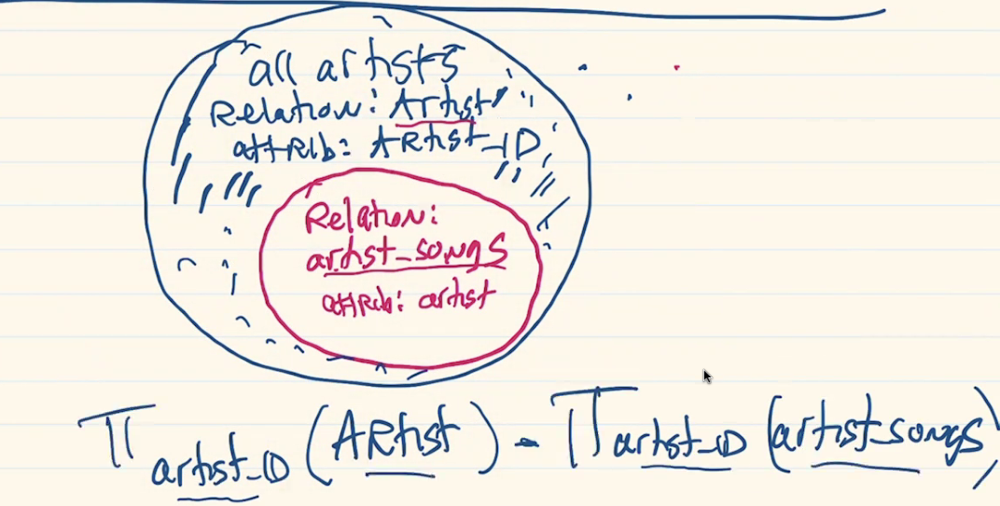
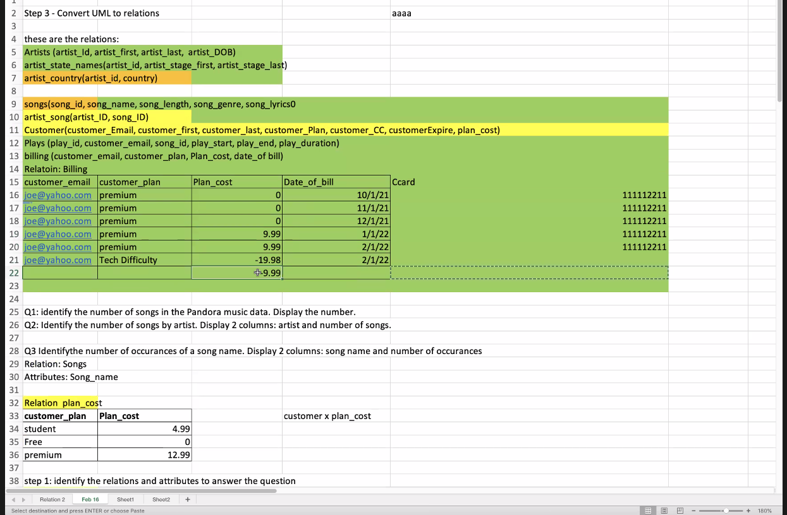
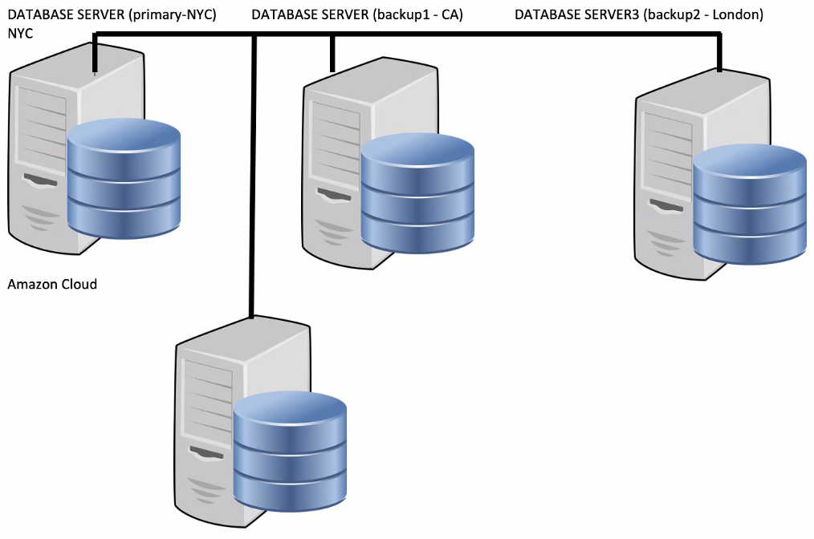

<style>
r { color: red }
o { color: orange }
b { color: blue }
</style>

<a id="top"></a>

# **Database System - *Daniel Laevitt***

3 exams

Individual work only

Databases are composed of Data, Attributes(Domains), Primary key attributes

Facebook
* Relationships between facebook users
* User- username, first name, last name, password
* Status(online, offline, away, busy, vacation)
* Group(Private, Public, Family, Friends...)

Amazon
* Products(Product_Name, Product_type, price, quantity, prime_status(Y/N))
* Users ( email, (first_name, last_name), organization, dept, (street, state, city, zip, country, planet), prime_member)
* Staff( job_title, salary, (hours, date), )


Domain email = [....]@[....].[....]

Prime_member(Regular, Student, NotPrimeMember)

Title(driver, manager, warehouse operator, ap ar, ....)

Domain Product_Type(Beauty, clothing, warehouse, food)


# _Class 3 - 2/7/22_

# Relational Algebra
Theoretical language with operations that work on one or more relations to define another relation without changing the original

Relation are closed under algebra, as numbers are closed under arithmetic

**Closure** - Output from one operation can become input to another


* Unary(Single Relation)
  * **Selection** of selected tuples
  * **Projection** of relation and selected attributes

* Binary(Pairs of Relations)
  * **Cartesian Product** equivalent to *set multiplication*
  * **Union** of relations
  * **Set Difference** A-B = &forall;x s/t x&isin;A and x&notin;B
  * **Intersection** tuples in both relations
  * **Natural Join A&#10781;B** - extended relation tuples
  * **Semi Join &#8883;** - 


* &delta; predicate (R) - **Selection**
* &prod; col1,...,cikn (R) - **Projection**

## <text style=color:orange>Decomposing complex operations (**&larr;**)
Giving a name to the results of intermediate operations to facilitate the extraction of desired cross-referencing. This allows the reuse of relations that result from intermediate operations 

TempView(clientID, propertyID, comment) &larr; &Pi;<sub>clientID, propertyID, comment)(Viewing)

TempClient(clientID, fName, lName) &larr; &#120504;<sub>clientID, fname, lname</sub>(Client)

Comment(clientID, fname, lname, vclientID, propertyID, comment) &larr; TempClient &#10005; TempView

Result &larr; **&sigma;**<sub>clientID=vclientID</sub>(Comment)

---
## <text style=color:orange>Selection **&sigma;<sub>predicate</sub>(R)**
Contains only tuples of R that satisfy the specified condition(*predicate*)

---
## <text style=color:orange>Projection **&#120503;<sub>a<sub>1..n</sub></sub>(R)**
On a single relation R, defines a vertical subset of R, extracting values of specified attributes and eliminating duplicates

---
## <text style=color:orange>Rename **&#120504;<sub>S</sub>(E)**
Provides a new name S to for the expression E. 

**&#120504;<sub>S<sub>1..n</sub></sub>(E)** : Optionally, the attributes S<sub>1..n</sub> may be renamed as well


---
## <text style=color:orange>Cartesian Product **R&#10005;S**
Concatenation of tuples, set multiplication

* List the names and comments of all clients who have viewed a property for rent

&#120503;<sub>clientID,fname,lname</sub>(Client) &#10005; &#120503;<sub>clientID, propertyID, comment</sub>(Viewing)

`This operation contains too much information, we need only tuples where the clientIDs are equal from both relations and the comment is not null`

**&sigma;**<sub>Client.clientID = Viewing.clientID</sub> (&#120503;<sub>clientID,fname,lname</sub>(Client) &#10005; &#120503;<sub>clientID, propertyID, comment</sub>(Viewing))

---
### Join Operations
Equivalent to performing a **Selection** operation, using the **join predicate** as the selection formula, **over the Cartesian Product** of the two operand relations
* Theta-join
* Equi-join
* Natural Join
* Outer join
* Semi-join

---
## <text style=color:orange>Theta join(&theta;-join) **R&#8904;<sub>F</sub>S**</text>
 R&#8904;<sub>F</sub>S = **&sigma;**<sub>F</sub>(R &#10005; S) &rArr;  Relation that contains tuples satisfying **predicate F** over Cartesian Product R x S.

Predicate F is of the form **R**a<sub>i</sub> &theta; **S**b<sub>i</sub>

Theta operators: &lt; &leq; &gt; &geq; = &ne;

The degree of a Theta join is the sum of the degrees of the operand relations R and S.

---
## <text style=color:orange>Equijoin
A Theta join where the predicate F contains **only equality (=)**

**(<text style=color:orange>&#120503;</text>
<text style=color:blue><sub>clientID, fname,lname</text>
<text style=color:red>(Client)</text>)
&#8904;
<sub>Client.clientID = Viewing.clientID</sub>
(<text style=color:orange>&#120503;</text>
<text style=color:blue><sub>clientID, propertyID, comment</text>
<text style=color:red>(Viewing)</text>)**

`or`

**Result** &larr; TempClient &#8904; <sub>TempClient.clientID = TempViewing.clientID</sub> TempViewing

---
## <text style=color:orange>Natural Join
An Equijoin of the relation R and S over all common attributes x. One ocurrence of each common attribute is eliminated from the result

**<text style=color:orange>&#120503;</text>
<text style=color:blue><sub>clientID, fname,lname</text>
<text style=color:red>(Client)</text>
&#8904;
<text style=color:orange>&#120503;</text>
<text style=color:blue><sub>clientID, propertyID, comment</text>
<text style=color:red>(Viewing)</text>**

`or`

**Result** &larr; TempClient &#8904; TempViewing

---
## <text style=color:orange>Outer Join **R &#10197; S**

Often, a tuple in one relation does not have a matching tuple in the other relation. We may want tuples from one of the relation to appear even when this is the case.

The **Left Outer join R &#10197; S** is a join in which **tuples from R** do **not have matching values** with the common attributes of S that **are included in the resulting relation**. Missing values are set to null.

> Outer join preserves tuples that would have been lost by other types of join

*Provide a status report on property viewings*

**(<text style=color:orange>&#120503;</text>
<text style=color:blue><sub>propertyID, street, city</text>
<text style=color:red>(PropertyForRent)</text>)
&#10197;
<text style=color:red>(Viewing)</text>**


A **Right Outer join** keeps every tuple in the right-hand relation in the result.

A **Full Outer join** keeps all tuples in both relations, padding tuples with nulls when there are not matches

---
## <text style=color:orange>Semi Join **R &#8883;<sub>F</sub> S**

Contains the tuples of R that participate in the join of R with S satisfying predicate F

Project over the attributes of the first operand **(R)**. It decreases the number of tuples to be handled.

* Computing joins in distributed systems

**R &#8883;<sub>F</sub> S = &#120503;<sub>A</sub>(R&#8904;<sub>F</sub>S)** &rArr; Projection of attributes A<sub>1..n</sub> from the relation join of R and S over predicate F **(Semi-Theta join)**

*List complete details of all staff who work at the branch in Glasgow*

**<text style=color:red>(Staff)</text>
&#8883;
<sub>Staff.branchID = Branch.branchID</sub>
(<text style=color:orange>&sigma;</text>
<text style=color:blue><sub>city='Glasgow'</text>
<text style=color:red>(Branch)</text>)**


> Only shows Staff relation atrributes

---
## <text style=color:orange>Division **R &div; S** 
Assume R is defined over atribute set A and S is defined over attribute set B such that B &sube; A. 

Let C = A - B &rArr; Set of Attributes of R that are not attributes of S

The **division operation R &div; S** defines a relation over the attributes C that consists of the set of tuples from R that match combination of **every** tuple in S

Division can be expressed as:

T<sub>1</sub> &larr; &#120503;<sub>c</sub>(R)

T<sub>2</sub> &larr; &#120503;<sub>c</sub>((T<sub>1</sub> &#10005; S) - R)

T &larr; T<sub>1</sub> - T<sub>2</sub>

*Identify all clients who have viewed all properties with three rooms*

> We can use Selection to find all properties with three rooms.

**3Room &larr; <text style=color:orange>&sigma;</text>
<text style=color:blue><sub>rooms=3</text>
<text style=color:red>(PropertyForRent)</text>**

>Projection to produce a relation containing only these properties

**3RoomIDs &larr; <text style=color:orange>&#120503;</text>
<text style=color:blue><sub>propertyID</text>
<text style=color:red>(3Room)</text>**

>Division: by projecting Viewing relation from attributes `clientID` and `propertyID` and dividing it by previous Projection

**T &larr; <text style=color:orange>&#120503;</text>
<text style=color:blue><sub>clientID, propertyID</text>
<text style=color:red>(Viewing)</text>**

>Result is a single attribute `clientID` relation

**Result &larr; T &div; 3RoomIDs** 


---
### Aggregation and Grouping
Often we want to perform a summation or aggregation of data, similar to the totals at the bottom of a report, or some form of grouping of data similar to subtotals.

## <text style=color:orange>Aggregate **<sub>AL</sub>(R)** 
Aggregate function list defines a relation over the aggregate list. Contains one or more **(function, attribute)** pair

* COUNT - returns the number of values associated with attribute
* SUM - returns the sum of the values on the associated attribute
* AVG - returns an average of attribute
* MIN/MAX - smallest/largest value in associated attribute

*How many properties cost more than $900/month to rent?*

---


Used Cars | Attributes
-: | :-
car | mileage, make, model, color, picture
customer| fname, lname, street, city, zip
trans | 
recall | vins

Netflix | Attributes
-: | :-
customer |
shows | title, genres, year, rating, language, duration, actors 
watching |

**Domain**
* rating = PG-13, PG, G, R
* language = French, English, ...
* genre = Sci-Fi, action, comedy, ...

Hospital | Attributes
-: | :-
staff | staff_ID, staff_first, staff_last, staff_title
patient | patient_ID, patient_first, patient_last, (address), insurance
room | room_ID, building, dept, occupied, floor
admission | patient_id, room_id, assigned_date
department | dept_id, dept_name, dept_phone, room
staff_dept | staff_id, dept_id
visit | patient_id, staff_id, date_of_visit, room_id, procedure
diagnosis | 

Dept_id | Dept_name | Dept_phone | [] | Staff_id | Staff_first | Staff_last
:-: | :-: | :-: | :-: | :-: | :-: | :-:
100 | ER | null |[]| 111111 | Sally | Smith
200 | Surgery | null |[]| 222222 | Ben | Dover
302 | ENT | null |[]| 33333 | Pik | Achu
99 | Billing | 718-997-1111 | []

### **Domains**
Insurance = Medicare, Medicaid, Blue Cross, UHC, Oxford...
Dept_name = Cardiology, ER, Surgery, ENT, mental health, transplant...
Procedude = Check up, exam, xray, surgery, sonogram, CAT Scan, MRI, cast

### **Composite Primary Key**
A pseudo primary key that is acquired by combining 2 or more foreign keys. In general, foreign keys cannot be used as primary keys in a Relation due to its lack of uniqueness

Staff_id | Dept_id
:-: | :-: 
11111 | 99
22222 | 100
3333 | 200
22222 | 302
11111 | 200

`combining foreign keys ...`

**Surgeon &larr;
<text style=color:orange>SELECTION</text>
<text style=color:blue>Predicate</text>
<text style=color:red>Relation</text>
&rArr;
<text style=color:orange>&delta;</text>
<text style=color:blue>staff_title = "surgeon"</text>
<text style=color:red>(Staff)**</text> 

> Relations can be joined only if there is a common attribute using the Cartesian Product


# _Class 4 - 2/9/22_

*Identify the room for patient Stephanie Jones. Display the room.*

Step 1: Identify the relations
* Patient, Patient_Room

Step 2: Identify the attributes
* Patient_first, Patient_last, room_ID

Step 3: Identify common attribute if performing a certesian product
* Patient(Patient_ID)

Step 4: Perform the search

Step 5: Display the output

**A &larr;
<text style=color:orange>&delta;</text>
<text style=color:blue>patient_first="Stephanie" &and; patient_last="Jones"</text>
<text style=color:red>(Patient)</text>**

**B &larr;
<text style=color:orange>&delta;</text>
<text style=color:blue>A.patient_ID = Patient_Room.patient_ID</text>
<text style=color:red>(A &#10005; Patient_Room)</text>**


# _Class 5 - 2/14/2022_


## UML

Unified Modeling Language

Multi-value indicator - `[1..x]`

Derived attribute - `\`

Arrows indicate relation between tables


# _Class 6 - 2/16/2022_

## Music Database

### 1. Questions the database should answer
1. Identify songs by genre, display count
2. Identify sounds and number of plays
3. Identify songs played more than once
4. Identify songs that started, but didn't complete playing(skipped)
5. Identify all songs by Motley Crue or Lagy Gaga
6. Identify song with specific words
7. Identify credit cards expiring soon. Display customer name and method of payment

### 2. Create UML Diagrams

### 3. Convert UML to relations
Artists(artist_id, artist_first, artist_last, artist_stage_name, artist_country, artist_language, artist_dob, artist_debute, artist_age)

artist_id | artist_first | artist_last | artist_stage_name | artist_country | artist_language | artist_dob
:-:|:-:|:-:|:-:|:-:|:-:|:-:
||Prince Rogers | Nelson | The artist; Camille; The artist formally known as prince | US | English | 6/7/58
||Stefani|Germanotta|Lagy Gaga|US; Canada|
||Jeffrey|Williams|Young Thug; SEX; Thugger; | US |English| 8/16/91
||Taylor|Swift||US; France | English


A solution to handle multi value attributes is by creating a separate relation that uniquely identifies each of the multiple attributes

ten commandments ofdatabases

minimize duplication: Make primary keys to prevent duplicate data

 Each realtion must have primary keys

 Ensure domain has limited values, foreign key second constraint

 attribute has a value, cannot be NULL

 Composite primary keys - Are all or some attributes going to be primary keys

 # `Com-PAH-sit` primary keys


# _Class 7 - 2/23/2022_

# Convert UML Diagram entities into Relations


## Types of attributes
* Primary/Foreign Key
* Simple
* Composite
* Single value
* Multi-value
* Derived


song_id | song_name | song_length | song_lyrics 
:-:|:-:|:-:|:-:
999999 | Let's Go Crazy | 2:30 | lalala-lyrics
77777 | Bad Romance | 3:15 | Baby some lyrics go here

`artist_stage_names(artist_id, artist_stage_first, artist_stage_last)`

`artist_country(artist_id, country)`

`songs(song_id, song_name, song_length, song_genere, song_lyrics)`

`artist_song(artist_id, song_id)`

`customer(customer_email, customer_first, customer_last, customer_plan, customer_cc, customer_expire, customer_address(street, zipcode, state, country))`

`plays(play_id, customer_email, song_id, play_start, play_end, play_duration)`

### Question 1:
Identify the country for the artist who sing "Bad Romance". Display Country

* Relation: artist_country - `artist_id`
* Relation: songs - `song_id`
* Relation: artist_song - `artist_id` and `song_id`

BR &larr; ẟsongs.songname="Bad Romance"(songs)

A &larr; ẟsong.song_id = artist_song.song_id(BR X artist_song)

`or`

A &larr; ẟsong.song_id = artist_song.song_id(song X artist_song)

B &larr; ẟA.artist_id = artist_country.artist_id(A X artitst_country)

BR &larr; ẟ


### Question 2:
Identify artist with no songs. Display the artist name.

* Relation: artists
* Relation: artist_song




# _Class 8 - 2/28/2022_

# Aggregate Data

### Question 1: Identify the # of songs. Display the number

A &larr; **J** COUNT(song_id)(Songs)


### Question 2: Identify # of customers by state. Display 2 colums: state and # of customers

customer_state **J** COUNT(customer_id)(Customer)

### Identify the number of Songs by artist

Relation: artist
* Attributes: artist_first, artist_last, artist_id

Relation: artist_song
* Attributes: artist_id

begin cartesian product

identify common attribute

Cartesian Product:

`artist and songs where artist.artist_id = artist_song.artist_id`

`or`

artist_id **J** COUNT(song_id)(artist_song)

**A &larr; 
<o>ẟ</o>
<b>artist.artist_id = artist_song.artist_id</b>
(<r>Artist X artist_song</r>)**

**B &larr; 
<o>Artist_first, artist_last</o>
<b>Ͻ (COUNT)artist_id</b>
<r> (A)</r>**

`or`

**B &larr;
Ρ<sub>(Artist Name, Artist Last, Number of Songs)</sub>
<o>Artist_first, artist_last</o>
<b>Ͻ (COUNT)artist_id</b>
<r> (A)</r>**

### Question 4: Identify the number of ocurrences of a song name. Display song name and number of ocurrences

Relation: Songs
Attributes: song_name

**Answer &larr;
P<sub>(Song Name, number of song ocurrences)</sub>
<o>song_name</o>
<b>Ͻ (COUNT)song_id</b>
<r> (Songs)</r>**

### Question 5: Assume plan_cost is in Customer relation. Identify the monthly revenue for all Active Customers.

Domain(customer_plan) &rarr; plan_cost
* Student - 4.99
* Free - 0
* Premium - 9.99

**Answer &larr;
<b>Ͻ (SUM)plan_cost</b>
<r> (Customer)</r>**

### Identify monthly revenue by state
**Answer &larr;
<o>customer_state</o>
<b>Ͻ (SUM)plan_cost</b>
<r> (Customer)</r>**

### Identify monthly revenue by state and show number of customers

**Answer &larr;
<o>customer_state</o>
<b>Ͻ (SUM)plan_cost, COUNT(customer_id)</b>
<r>(Customer)</r>**




# _Class 9 - 3/2/2022_

# Relational Algebra

## SQL - 'see-quell'
`Structure Query Language`

<div style="display: flex; align-items:center;">
<div>

Relational Database Management System(DBMS)
1. Oracle
   * Windows
   * Unix
2. IBM
   * Windows
   * Unix
   * Mainframe
3. Microsoft
   * OS-Windows
</div>
<div>

## SQL
1. Search
2. Add
3. Change
4. Delete
</div>
</div>

## Different terminology:

<div style="display: flex; align-items:center;">
<div style="width:40%;">

**Relational Algebra** | **Database**
:-: | :-:
Relation | Table
Tuple | Row
Attribute | Column

Candy
* Manufacturer
* Expiration date
* Price
* Product Type
  * Drink
  * Candy
  * Been
  * Newspaper
* Size
  * Domain(S,M,L)
* Type
* Candy name
</div>

<div>

## Type of Data

1. Numbers
   * decimals
   * decimals
2. Text
   * any key on the keyboard
   * *&^%$S@ Symbols
   * 0-9
   * A-Z
   * 
   * unicode cjk
   * "y" or 'y'
   * 2/1-31/2021
   * char(25)
   * 
3. Boolean
   * Y/N - T/F
4. Data/Time
   * MM DD YY HH Mi SS
   * 5/1/2021
  
</div>
</div>


```SQL
CREATE TABLE PRODUCT

(PRODUCT_ID NUMBER PRIMARY KEY,

PRODUCT_PRICE DECIMAL(12,2))


INSERT INTO PRODUCT(product_id, product_price)

VALUES(1000, 3.25)


SELECT * FROM PRODUCT;

```

# Exam 1 Date: 3/9

ℑ


[to top](#top)

# _Class 16 - 4/4/2022_

## **`Database Requirements for Backup and Recovery`**

1. no data loss
2. speed
3. cost
4. reliability

Active business from 7am - 8pm. 

Say the storage fails at 10am 


[to top](#top)

# _Class 17 - 4/6/2022_

## **`Backup and Recovery II`**

What happens if the main server fails?

Everything written to main server should be copied in prallel to another server physically somewhere else.

Database downtime should be zero



**What's the backup scenario assuming all servers fail, with a small budget, that requires zero data loss?**

What storage devices can be used?

* Hard drive - magnetic
* Solid state drive - chip, memory, fast, high cost

Device | Speed/byte (r/w) | Capacity | Cost | Volatility
:-:|-:|-:|-:|:-:
Magnetic - hard drive | 1-100 **milli**sec | 5 TB | $300 | 
SSD - solids state drive | 100-1000 **nano**sec |5 TB | $4000 | 
CD | 800 **milli**secs | 1 GB | $5 
DVD | 800 **milli**secs | 5 GB | $10
Floppy disk | 900 **milli**secs | 1.4 MB | $0.25
Memory(RAM) | 1-20 **nano**secs | 128 GB | $5000 | Yes
~Paper..? | 1 page/**sec** | 1000 2 MB | $10~
Tape | seconds | 2 TB | $100 |

### **`RAID`**

Redundant array of independent disks

**Parity**

Parity bits

RAID I : 1 set of disks(8) and 1 set of mirrors(8) and 2 parity disks(primary and backup)


[to top](#top)

# _Class 18 - 4/11/2022_

## **`Backup and Recovery III`**

Evaluate
1. No data lose
2. No downtime


[to top](#top)

# _Class 19 - 4/13/2022_

## **`Backup and Recovery IIII`**

Exam 2 Topics:
1. SQL
2. Normalization

Format
1. Blackboard

Create a Database for CVS
* UML
* Create Tables
* Normalized
* Identify appropriate column types
  * zipcode - **char(5)**
  * phone - **char(10)**
  * SS# - **char(8)**
  * class code - **char(5)**
  * credit card - **char(16)**
  * Date_of_birth "January 15, 2021" - **varchar(20)**, date mm/dd/yyyy **(constraint)**
  * column type
    * if calculations performed, then the column type is: **number/decimal**
    * if no calculations are performed and every digit is significant: **text varchar, char**


Normalize:
* 2nd Normalize Form - Functionally Dependent
  * PK
  * Non PK Attribute
  * **keep IF**  non-PK attribute is functionally dependent on the PK
    * **else** push column aside
    * multivalue fields will be saved to their own table

SQL:
* **CREATE TABLE**
* **INSERT**
* **UPDATE**
* **DELETE**
  * STAFF
  * PRODUCTS
  * CUSTOMER
    * DELETE FROM CUSTOMER WHERE CUST_ID = 11111;
      * add attribute to customer table **CUST_STATUS= 'A' 'D'**
  * PURCHASES(CUST_ID, PROD_ID, DATE_OF_PURCHASE, STORE_ID, PRICE)
* **ALTER TABLE** - change table structure(rename column, change data type, add/drop column)
* OUTPUT


[to top](#top)

# _Class 24 - 5/11/2022_

Dionad Trumop hidin taxes to not show income profit loss margin being negative, bad PR

## **`United States privacy laws `**

**`Minimalist Approach`**

**`Banking`**

**`Health Insurance Portability Act(HIPPA)`**

Compliance - access to data doctors and patients have access to HIPPA. If a **non-need-to-know** individual access this kind of information, despite the sentiment, penalties may incur

**`Student Data Privacy`**

**CUNY** has to be in compliance with the rules and regulations of the USA and 
Separate unique identifier numbers were required replacing the SSN

**`Patriot Act`**

Government cannot conduct search of emails or calls without previous authorization

**bulk metadata collection**

email(Gmail, Yahoo, iCloud)
  * subject
  * body
  * attachments
  * recipients
  * internet message id
  * to
  * from
  * cc
  * bcc
  * data/time
  * email address
  * IP

Phone(Verizon, Sprint, T-Mobile)
  * call duration
  * start time
  * end time
  * call recipient
  * call sender
  * carrier
  * phone
  * location

## Outside the United States - **European Union**

**GDPR** - European Union Data Protection

Implemented in 2018
Give control to individuals over their personal data
Create and manages databases to be in compliance with these
regulations
Can't identify individuals
Individuals can revoke permission
Adopted by Chile, Japan, Brazil, South Korea, Argentina and Kenya

**How can citizens data not be stored but be used to identify them?**
Personal Identifible Information(PII)
* SS#
* Name
* DOB
* Drivers License
* Address
* Passport
* Credit Card
* Phone


# Project 2

The purpose of this Project is to get familiar with Oracle using SQL Developer, and to analyze the data of dog licenses issued by New York City between 2014 and 2021 using New York State zip code data.

First, create the required database tables.

## New York State zip code’s table:

After examining the data on the Excel sheet, I determine table requirements from max-length of each column, e.g. zipcode format is always 5 digits, and the city's name column length does not exceed 25 characters.
```sql
create table zipcodes(
zipcode char(5),
city varchar(25),
county varchar(20)
zip_type varchar(10)
);
```
The primary key for zip code table is added using a sequence, update and alter table queries after data import.

```sql
create sequence zip_id_seq increment by 1 start with 1;
alter table zipcodes add id number;

update zipcodes set id = zip_id_seq.nextval;
alter table zipcodes modify id primary key;

alter table zipcodes modify(zipcode invisible, city invisible, county invisible, zip_type invisible);
alter table zipcodes modify(zipcode visible, city visible, county visible, zip_type visible);
```
These commands create a sequence `zip_id_seq` increasing in single increments, and create a column `id` for the **zipcodes table**.
Next, the `id` column is set to the next value of the sequence created, starting at 1 and the column is assigned as a **primary key** attribute.
The last 2 lines move the column we just added to the front, meaning the table structure is now `id, zipcode, city, county, zip_type`


## The NYC Dog Licenses table:

This database also requires a primary key, to keep track of individual entries. Upon examining the data on excel, and matching them with the database table requirements, the following columns and data formats are used.
Additionally, primary key column insertion is implemented during table creation as `id` using a sequence and populated at import using `default` argument

**Questions 1, 2: Create new PK for dog's table and Populate PK with unique values**
```sql
create sequence dog_id_seq increment by 1 start with 10000;

create table dogs(
id number default dog_id_seq.nextval primary key,
animal_name varchar(30),
animal_gender char(1),
animal_birth_year number(4),
breed_name varchar(40),
zipcode char(5),
license_issued_date date,
license_expire_date date
);
```
To make sure the import was succesful, the excel sheet row count must match the count of this query
[img]

All rows have been imported, the following query checks the primary key `id` is **unique**. The key must be unique if there are 493,072 distinct `id` values, the same number of rows we previously imported.
[img]

To make querying simpler, I will create a view with simplified column names and name is **`dogsSimpleView`**
```sql
create view dogsSimpleView as
select dogs.id, dogs.animal_name as name, dogs.animal_gender as gender, 
dogs.animal_birth_year as birth, dogs.breed_name as breed, 
dogs.license_issue_date as l_issue, dogs.license_expire_date as l_expire, 
dogs.zipcode from dogs;
```

**Question 3: Identify the most popular dog names for licenses issued in 2020**
The queries for questions 3, 4, and 5, explicitly exclude rows from the output that contain placeholder data on the `name` field, such as **unkown** and **name not provided**. It is important to mention however, the licenses issued with placeholder name data will be used in other queries

```sql
select name as "Dog Name", 
to_char(count(id), '999,999') as "Licenses Issued in 2020" from dogsSimpleView
where extract(year from l_issue)=2020 and
name not like 'UNKNOWN' and name != 'NAME NOT PROVIDED'
group by name order by count(id) desc;
```
 [img]

 **Questions 4, 5: Identify most popular `male`/`female` dog names for licenses issued in 2020**
 ```sql
select name as "Male Dog Name", 
to_char(count(id), '999,999') as "Licenses Issued in 2020" from dogsSimpleView
where extract(year from l_issue)=2020 and gender='M' and 
name not like 'UNKNOWN' and name != 'NAME NOT PROVIDED'
group by name order by count(id) desc;
 ```
  [img]
 Changing line 1 in query to `select name as "Female Dog Name",` and line 3 - `gender='M'` to - `gender='F'` outputs the most popular **female** dog names

[img]

**Question 6: Identify the number of Chihuahuas by county/borough for licenses issued in 2020. Display the breed, county/borough and number of dogs**
This query requires performing a cartesian product of tables dogs and zipcodes on the database's common attribute `zipcode`. This query filters out all those licenses issued with an invalid zip code, or one that is not an official NYS zip code.
To make querying simpler, I create a view called **alldogsSimpleView**.
```sql
create view alldogsSimpleView as
select dogs.id, dogs.animal_name name, dogs.animal_gender gender, dogs.animal_birth_year birth,
dogs.breed_name breed, dogs.license_issue_date l_issue, dogs.license_expire_date l_expire, 
zipcodes.zipcode zipcode, zipcodes.city city, zipcodes.county county
from dogs, zipcodes where zipcodes.zipcode = dogs.zipcode;
```
This view is what I'm going to use for all the remaining queries.

```sql
select breed Breed, county County, count(*) "Number of Dogs" from alldogsSimpleView
where breed='Chihuahua' and extract(year from l_issue)=2020
group by breed, county;
```
[img]

**Question 7: Identify most popular breeds near Queens College(11367) for licenses issues in 2020**
For this query, I filter out dog licenses with **unknown** breed.
```sql
select breed "Most Popular Breeds near Queens College", count(*) "Number of Dogs" 
from alldogsSimpleView where zipcode = 11367 and extract(year from l_issue)=2020 
and breed!='Unknown' group by breed order by 2 desc;
```
[img]

**Question 8: Identify the oldest dogs. Display animal's name, gender, breed, zipcode, and county**
For this query, I filter out dog licenses issued that exceed a dog's life expectancy of 15-20 years.
```sql
with Result as (
select name "Oldest Dog's Name", gender "M/F", breed "Breed", zipcode "Zip Code", county "County",
extract(year from current_date)-birth "Dog's Age"
from alldogsSimpleView order by 6 desc
) select * from result where "Dog's Age" <= 20;
```
[img]

**Question 9: Identify the zipcodes with the fewest dog licenses issued in 2020. Display the least popular zipcode first, county and number of dogs**
```sql
select zipcode "Least Popular Zipcodes", county "County", 
count(*) "Number of Licenses Issued in 2020" from alldogsSimpleView
where extract(year from l_issue)=2020 group by zipcode, county
order by 3 asc;
```
[img]

**Analysis**
For the analysis of my own choosing, I will delete duplicate entries from the dogs table, find the least popular zipcodes from each county, and thus find which zipcodes and counties are the least popular from all time.
```sql
DELETE from dogs where id in(
select rn from(
    select animal_name, breed_name, animal_birth_year, dogs.zipcode, license_issue_date, license_expire_date, 
    row_number()over(partition by animal_name, breed_name, animal_birth_year, zipcode, license_issue_date, 
    license_expire_date order by dogs.zipcode) rn from dogs
    order by zipcode
    ) where rn > 1
);    
```
[img]
The inner code of this sql command groups all rows with the same values(duplicates) and enumarates them. The outer part delete all those values that are enumarated 2 and above, thus removing duplicates by leaving on the dogs table only one distinct value.
[img]
```sql
create view analysis as
select dogs.animal_name name, dogs.breed_name breed, dogs.animal_gender gender, dogs.animal_birth_year birth, 
extract(year from current_date)-dogs.animal_birth_year age, zipcodes.zipcode, 
dogs.license_issue_date l_issue, dogs.license_expire_date l_expire, zipcodes.city, zipcodes.county, zipcodes.zip_type,
row_number() over(partition by dogs.animal_name, dogs.breed_name, dogs.animal_gender, dogs.animal_birth_year, zipcodes.zipcode, 
dogs.license_issue_date, dogs.license_expire_date, zipcodes.city, zipcodes.county, zipcodes.zip_type order by dogs.id) "ROW"
from dogs, zipcodes
where zipcodes.zipcode = dogs.zipcode;
```
Here I create a view with all the relevant data from the dogs and zipcodes cartesian product
[img]
Finally I perform the analysis on the view and find the least popular counties and zipcodes, displaying all information about the dog's license
```sql
with Result as (
select
county "County", count(l_issue) over (partition by county) as "Licenses in County",
zipcode "Zipcode", count(l_issue) over (partition by zipcode) as "Licenses in Zip",
name, extract(year from current_date)-birth "Dog's Age",  breed "Breed", gender "M/F", 
l_issue "License Issue Date", city "City"
from analysis
where name != 'UNKNOWN' and name != 'NAME NOT PROVIDED'
) select * from Result 
order by 2, 3;
```
[img]
According to this output, there are 10 Counties with a single license given, making the zipcodes in those conties the least popular.

**Display the structure of all tables**
[img]

**Display the version of Oracle**
[img]


Astronaur(AID, Afirst, Alast)
Mission (MID, Space Shuttle 45, Sally Ride)
MissionAstro(AID, MID)
