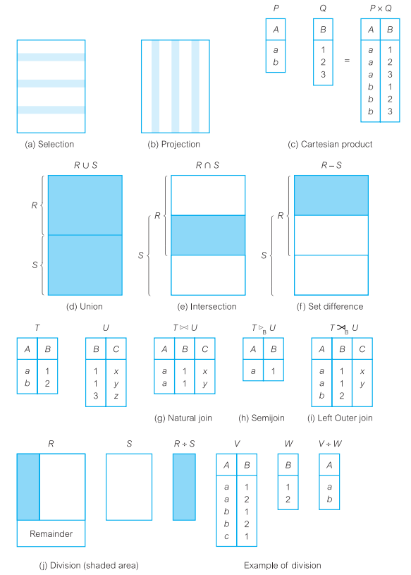
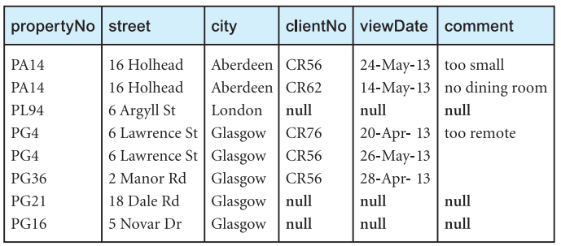
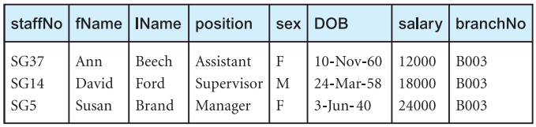
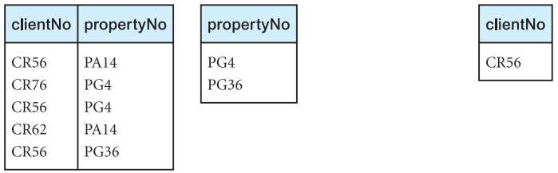
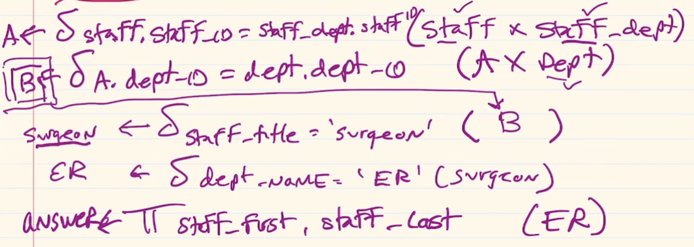

# **Database System - *Daniel Laevitt***

3 exams

Individual work only

Databases are composed of Data, Attributes(Domains), Primary key attributes

Facebook
* Relationships between facebook users
* User- username, first name, last name, password
* Status(online, offline, away, busy, vacation)
* Group(Private, Public, Family, Friends...)

Amazon
* Products(Product_Name, Product_type, price, quantity, prime_status(Y/N))
* Users ( email, (first_name, last_name), organization, dept, (street, state, city, zip, country, planet), prime_member)
* Staff( job_title, salary, (hours, date), )

Domain email = [....]@[....].[....]

Prime_member(Regular, Student, NotPrimeMember)

Title(driver, manager, warehouse operator, ap ar, ....)

Domain Product_Type(Beauty, clothing, warehouse, food)

## _Class 3 - 2/7/22_

# Relational Algebra
Theoretical language with operations that work on one or more relations to define another relation without changing the original

Relation are closed under algebra, as numbers are closed under arithmetic

**Closure** - Output from one operation can become input to another

* Unary(Single Relation)
  * **Selection** of selected tuples
  * **Projection** of relation and selected attributes

* Binary(Pairs of Relations)
  * **Cartesian Product** equivalent to *set multiplication*
  * **Union** of relations
  * **Set Difference** A-B = &forall;x s/t x&isin;A and x&notin;B
  * **Intersection** tuples in both relations
  * **Natural Join A&#10781;B** - extended relation tuples
  * **Semi Join &#8883;** - 

* &delta; predicate (R) - **Selection**
* &prod; col1,...,cikn (R) - **Projection**

## <text style=color:orange>Decomposing complex operations (**&larr;**)
Giving a name to the results of intermediate operations to facilitate the extraction of desired cross-referencing. This allows the reuse of relations that result from intermediate operations 

TempView(clientID, propertyID, comment) &larr; &Pi;clientID, propertyID, comment)(Viewing)

TempClient(clientID, fName, lName) &larr; &#120504;clientID, fname, lname(Client)

Comment(clientID, fname, lname, vclientID, propertyID, comment) &larr; TempClient &#10005; TempView

Result &larr; **&sigma;**clientID=vclientID(Comment)

---
## <text style=color:orange>Selection **&sigma;predicate(R)**
Contains only tuples of R that satisfy the specified condition(*predicate*)

---
## <text style=color:orange>Projection **&#120503;a1..n(R)**
On a single relation R, defines a vertical subset of R, extracting values of specified attributes and eliminating duplicates

---
## <text style=color:orange>Rename **&#120504;S(E)**
Provides a new name S to for the expression E. 

**&#120504;S1..n(E)** : Optionally, the attributes S1..n may be renamed as well

---
## <text style=color:orange>Cartesian Product **R&#10005;S**
Concatenation of tuples, set multiplication

* List the names and comments of all clients who have viewed a property for rent

&#120503;clientID,fname,lname(Client) &#10005; &#120503;clientID, propertyID, comment(Viewing)

`This operation contains too much information, we need only tuples where the clientIDs are equal from both relations and the comment is not null`

**&sigma;**Client.clientID = Viewing.clientID (&#120503;clientID,fname,lname(Client) &#10005; &#120503;clientID, propertyID, comment(Viewing))

---
### Join Operations
Equivalent to performing a **Selection** operation, using the **join predicate** as the selection formula, **over the Cartesian Product** of the two operand relations
* Theta-join
* Equi-join
* Natural Join
* Outer join
* Semi-join

---
## <text style=color:orange>Theta join(&theta;-join) **R&#8904;FS**</text>
 R&#8904;FS = **&sigma;**F(R &#10005; S) &rArr;  Relation that contains tuples satisfying **predicate F** over Cartesian Product R x S.

Predicate F is of the form **R**ai &theta; **S**bi

Theta operators: &lt; &leq; &gt; &geq; = &ne;

The degree of a Theta join is the sum of the degrees of the operand relations R and S.

---
## <text style=color:orange>Equijoin
A Theta join where the predicate F contains **only equality (=)**

**(<text style=color:orange>&#120503;</text>
<text style=color:blue>clientID, fname,lname</text>
<text style=color:red>(Client)</text>)
&#8904;
Client.clientID = Viewing.clientID
(<text style=color:orange>&#120503;</text>
<text style=color:blue>clientID, propertyID, comment</text>
<text style=color:red>(Viewing)</text>)**

`or`

**Result** &larr; TempClient &#8904; TempClient.clientID = TempViewing.clientID TempViewing

---
## <text style=color:orange>Natural Join
An Equijoin of the relation R and S over all common attributes x. One ocurrence of each common attribute is eliminated from the result

**<text style=color:orange>&#120503;</text>
<text style=color:blue>clientID, fname,lname</text>
<text style=color:red>(Client)</text>
&#8904;
<text style=color:orange>&#120503;</text>
<text style=color:blue>clientID, propertyID, comment</text>
<text style=color:red>(Viewing)</text>**

`or`

**Result** &larr; TempClient &#8904; TempViewing

---
## <text style=color:orange>Outer Join **R &#10197; S**

Often, a tuple in one relation does not have a matching tuple in the other relation. We may want tuples from one of the relation to appear even when this is the case.

The **Left Outer join R &#10197; S** is a join in which **tuples from R** do **not have matching values** with the common attributes of S that **are included in the resulting relation**. Missing values are set to null.

> Outer join preserves tuples that would have been lost by other types of join

*Provide a status report on property viewings*

**(<text style=color:orange>&#120503;</text>
<text style=color:blue>propertyID, street, city</text>
<text style=color:red>(PropertyForRent)</text>)
&#10197;
<text style=color:red>(Viewing)</text>**

A **Right Outer join** keeps every tuple in the right-hand relation in the result.

A **Full Outer join** keeps all tuples in both relations, padding tuples with nulls when there are not matches

---
## <text style=color:orange>Semi Join **R &#8883;F S**

Contains the tuples of R that participate in the join of R with S satisfying predicate F

Project over the attributes of the first operand **(R)**. It decreases the number of tuples to be handled.

* Computing joins in distributed systems

**R &#8883;F S = &#120503;A(R&#8904;FS)** &rArr; Projection of attributes A1..n from the relation join of R and S over predicate F **(Semi-Theta join)**

*List complete details of all staff who work at the branch in Glasgow*

**<text style=color:red>(Staff)</text>
&#8883;
Staff.branchID = Branch.branchID
(<text style=color:orange>&sigma;</text>
<text style=color:blue>city='Glasgow'</text>
<text style=color:red>(Branch)</text>)**

> Only shows Staff relation atrributes

---
## <text style=color:orange>Division **R &div; S** 
Assume R is defined over atribute set A and S is defined over attribute set B such that B &sube; A. 

Let C = A - B &rArr; Set of Attributes of R that are not attributes of S

The **division operation R &div; S** defines a relation over the attributes C that consists of the set of tuples from R that match combination of **every** tuple in S

Division can be expressed as:

T1 &larr; &#120503;c(R)

T2 &larr; &#120503;c((T1 &#10005; S) - R)

T &larr; T1 - T2

*Identify all clients who have viewed all properties with three rooms*

> We can use Selection to find all properties with three rooms.

**3Room &larr; <text style=color:orange>&sigma;</text>
<text style=color:blue>rooms=3</text>
<text style=color:red>(PropertyForRent)</text>**

>Projection to produce a relation containing only these properties

**3RoomIDs &larr; <text style=color:orange>&#120503;</text>
<text style=color:blue>propertyID</text>
<text style=color:red>(3Room)</text>**

>Division: by projecting Viewing relation from attributes `clientID` and `propertyID` and dividing it by previous Projection

**T &larr; <text style=color:orange>&#120503;</text>
<text style=color:blue>clientID, propertyID</text>
<text style=color:red>(Viewing)</text>**

>Result is a single attribute `clientID` relation

**Result &larr; T &div; 3RoomIDs** 

---
### Aggregation and Grouping
Often we want to perform a summation or aggregation of data, similar to the totals at the bottom of a report, or some form of grouping of data similar to subtotals.

## <text style=color:orange>Aggregate **AL(R)** 
Aggregate function list defines a relation over the aggregate list. Contains one or more **(function, attribute)** pair

* COUNT - returns the number of values associated with attribute
* SUM - returns the sum of the values on the associated attribute
* AVG - returns an average of attribute
* MIN/MAX - smallest/largest value in associated attribute

*How many properties cost more than $900/month to rent?*

---

Used Cars | Attributes
-: | :-
car | mileage, make, model, color, picture
customer| fname, lname, street, city, zip
trans | 
recall | vins

Netflix | Attributes
-: | :-
customer |
shows | title, genres, year, rating, language, duration, actors 
watching |

**Domain**
* rating = PG-13, PG, G, R
* language = French, English, ...
* genre = Sci-Fi, action, comedy, ...

Hospital | Attributes
-: | :-
staff | staff_ID, staff_first, staff_last, staff_title
patient | patient_ID, patient_first, patient_last, (address), insurance
room | room_ID, building, dept, occupied, floor
admission | patient_id, room_id, assigned_date
department | dept_id, dept_name, dept_phone, room
staff_dept | staff_id, dept_id
visit | patient_id, staff_id, date_of_visit, room_id, procedure
diagnosis | 

Dept_id | Dept_name | Dept_phone | [] | Staff_id | Staff_first | Staff_last
:-: | :-: | :-: | :-: | :-: | :-: | :-:
100 | ER | null |[]| 111111 | Sally | Smith
200 | Surgery | null |[]| 222222 | Ben | Dover
302 | ENT | null |[]| 33333 | Pik | Achu
99 | Billing | 718-997-1111 | []

### **Domains**
Insurance = Medicare, Medicaid, Blue Cross, UHC, Oxford...
Dept_name = Cardiology, ER, Surgery, ENT, mental health, transplant...
Procedude = Check up, exam, xray, surgery, sonogram, CAT Scan, MRI, cast

### **Composite Primary Key**
A pseudo primary key that is acquired by combining 2 or more foreign keys. In general, foreign keys cannot be used as primary keys in a Relation due to its lack of uniqueness

Staff_id | Dept_id
:-: | :-: 
11111 | 99
22222 | 100
3333 | 200
22222 | 302
11111 | 200

`combining foreign keys ...`

**Surgeon &larr;
<text style=color:orange>SELECTION</text>
<text style=color:blue>Predicate</text>
<text style=color:red>Relation</text>
&rArr;
<text style=color:orange>&delta;</text>
<text style=color:blue>staff_title = "surgeon"</text>
<text style=color:red>(Staff)**</text> 

> Relations can be joined only if there is a common attribute using the Cartesian Product

## _Class 4 - 2/9/22_

*Identify the room for patient Stephanie Jones. Display the room.*

Step 1: Identify the relations
* Patient, Patient_Room

Step 2: Identify the attributes
* Patient_first, Patient_last, room_ID

Step 3: Identify common attribute if performing a certesian product
* Patient(Patient_ID)

Step 4: Perform the search

Step 5: Display the output

**A &larr;
<text style=color:orange>&delta;</text>
<text style=color:blue>patient_first="Stephanie" &and; patient_last="Jones"</text>
<text style=color:red>(Patient)</text>**

**B &larr;
<text style=color:orange>&delta;</text>
<text style=color:blue>A.patient_ID = Patient_Room.patient_ID</text>
<text style=color:red>(A &#10005; Patient_Room)</text>**

