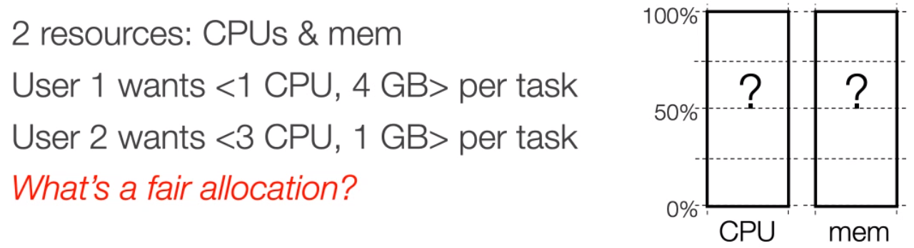

<a id="top"></a>

# Table of Contents

#### [`Introduction`](#intro)
#### [`Virtualization - Containers`](#class6)
#### [`Virtualization - Containers`](#class7)
#### [`Kubernetes`](#kubernet)


# *Class 1 - 2/1/2022*

# Intro

**Virtualization, networking, storage, database, data analytics, machine learning**


* AWS Educate credit ($100) 
  * https://aws.amazon.com/blogs/aws/aws-educate-credits-training-content-and-collaboration-for-students-educators/
* Google Cloud credit ($300)
  * https://cloud.google.com/free‣Microsoft 
* Azure free credit ($100) 
  * https://azure.microsoft.com/en-us/free/students/

**Cloud computing**: global scale rented services that are not possible in traditional private data centers. Shipped to local device over internet, resources delivered from data centers.

### Major Platforms by Q3 2021
**Amazon AWS, Google GCP, Microsoft Azure, (Alibaba, salesforce, IBM)**
* AWS 32%
* Azure 21%
* Google Cloud 8%
* Others 39%

Initially, cloud services provided at *infrastructure level*. Updated version of virtual servers: **Utility Computing**
* VMWare, Xen, KVM, VirtualBox

### **Utility computing**
Pool of virtualized computer resources that IT can access on demand

`Cloud computing describes the use of software, storage, or processing services delivered over the Web from massive data centers`

* Outsourcing hardware and software to Internet services provicers
* Style of computing where massively scalable IT-enabled capabilities are proviced *as a service* over network

## Everything-as-a-service


## Characteristics
* **On-demand self-service** -  Cloud Service provides resources: such as server time, storage network or network bandwidth, without requiring human interaction
  * "unilateral provisioning of computing resources"
* **Broad network access** - capabilities available over network and accessed through heterogeneous thin or thick client platforms(phones, tables, laptops, workstations)
* **Resource pooling** -  Computing resources are pooled to serve multiple consumers using a **multi-tenant model**
* **Rapid lasticity** scale up or down of resources through elastic provisioning or release of capabilities in near real time
* **Measured service** - Resource usage can be monited, controlled, reported: *pay-as-you-go*

**Resource planning at traditional data center**: Amazon provides free cloud services because they have extra resources during *non-peak* seasons

Under utilized infrastructure on days with least/lower demand. If you build enough capacity for average demand, during peak hours, average demand capacity servers yield no reponse and lost revenue. 

Similarly, building for highest demand yields under-utilized servers and resources during large periods of time. 

## **Cloud economics**

Purchasing, powering and managing machines at giga-scales yield lower per-unit costs that customers

Traditional data centers are notoriously under-utilized, often idle **85%** of the time


### **Pay-as-you-go**

* Most services charge per minute, byte, etc
* No minimum or up-front free
* Helpful when app-utilization varies 


**Amazon EC2 On-Demand** - provides elastic computing with different size virtual machines. *free usage t2.micro*

Underlying network and system components varies per type of VM.

### **Elasticity**

* Using 1000 servers for 1 hour costs the same as 1 server for 1000 hours
* Same price to get a result faster

> Virtualization - `without virtual machines:` a single OS owns all hardware resources.
> 
>> `with VMS:` Multiple Operating Systems share hardware resources, allowing multiple users on a single machine


[to top](#top)

# *Class 2 - 2/3/2022*

## Containerized data centers
IBM - 30% less to design and build **Containerized data center** than traditional one with raised floors are air-conditioning.

**45** X-Gene cartridges in one **4.3U** chasis. Each has **64GB DDr3 DRAM and 480GB flash** and **Ubuntu server** 14.04 LTS

## Cloud Deployment mode

### **Public Cloud**
Cloud infrastructure available to the **general public**, owned by organization selling cloud services
* Large scale on a rental basis
  * Access remotely under some Service Level Agreement **(SLAs)**
  * usually has global network of data centers
* Fully customer self-service
  * Requests are accepted and resources accesses/granted via web services
* E-commerce accountability
  * Web-based transaction, utility style costing
  * Pas-as-you-go

### **Private Cloud**
Infrastructure for **single organization only**, may be managed by the org or a 3rd party(Virtual Private Cloud), hosted internally or externally

Key techniques
* Virtualization techniques(VMWare, Xen, KVM) 
* Virtual Private network(VPN)

More expensive, more secure(behind firewall) when compared to public clouds
* Still have to buy, build and manage
* May not free from the responsibility for procurring (hardware+software upgrade$$) and maintenance(in-house expertise $$$)

Examples of Private Cloud services provided
* New York Times "Time Machine": 15 million articles were put into the cloud on servers owned by Amazon

* Open-source Software for building private and public clouds: 
  * **Open Stack** - https://www.openstack.org
  * **Apache CloudStack** - htt[s://cloudstack.apache.org]

### **Community Cloud**
Shared by several organizations that have shared concerns.

Multi-tentant infrastructure shared among organizations from a specific community with similar needs

Some users may required different levels of security

* High Security: Access to cloud is granted only after a trusted validation of identity(required by regulating bodies)

* High Availability: Resources are 99.99% available(or better): 
  * **Banking** and **Military**

* High Performance: Optimized for high transaction rates and extremely low-latency: 
  * Q1a
Hundreds of fans tunnel hot air from the server racks into a cooling unit to be recirculated in. The **green lights** are the server status LEDs reflecting 

## Facebook's data center

Doesn't use traditional air conditioning, instead relying completly on outside air.

Power Usage Effectiveness @Prineville 

## AWS's data centers

The AWS Cloud spans 84 Availability Zones within 26


# *Class 4 - 2/15/2022*

[to top](#top)


<a id="class6"></a>

# *Class 6 - 2/22/2022*


<a id="class7"></a>

[to top](#top)

# *Class 7 - 2/24/2022*

## Everything at google runs in cointainers
* Gmail Webserach Maps
* MapReduce MillWHeel Pregel
* Colossus BigTable SPanner
* Even Gogogle Cloud COmputing

## Container Orchestration
**More than packing and isolation needed**

Scheduling - Where should containers run

Lifecycle and health - Keep containers running despite failures

Discovery - Where containers are at now

Monitoring - What's happening with containers

Auth{n,z} - Control who can do things to containers

Aggregates - Compose sets of containers into jobs

Scaling - Making jobs bigger or smaller

**Containers working together have dependencies.**

## Open Source Containers: **`Kubernetes`**

Greek for Helmsamn; also the root of the word Governor and cybernetic
* Container orchestrator
* Built on Docker containers → supports other container technologies
* Multiple cloud and bare-metal environments
* Supports existing OSS apps
  * cannot require appds becoming cloud-native
* Inspired and informed by Google's experiences and internal systems
* **100% Open source**, written in **GO**

Let users manage applications, not machines


## **`Architecture`**


### **`Pod`**

Fundamental unit of deployed and scheduled containers.

Pod may have single or multiple containers

Containers in a pod run on the same node and share resources → file systems, kernel, namespaces, and IP address

### **`Kubelet`**

Receives specifications from API Server and amanges pods running in the host

Daemon for managing pod on worker node

Receives instructions from API server **(kubernet master)**, and performs duties and manages pods on worker nodes.

### **`API Server`**

Management hub for the Kubernetes master node. 

Facilitates communication between various componenets

Maintains cluster health

Front-end of master node, interacts with the user

### **`etcd`**

Stores configuration received by API Server Daemon.

Congirations are performed by Scheduler and Controller Manager

Can be accessed by the Kubernetes Master's API Server using HTTP or JSON API

### **`Scheduler`**

Decides the location(containers) in which application will be running on

Places workload on the appropriate node

### **`Controller Manager`**

Ensures that the cluster's desired state matches the current state by scaling workloads up or down

Maintains the service inside the Kubernetes cluster.

## **`Pods`**

A kubernetes abstraction represents a group of one or more application containers, and some shared resources for those containers

* Shared storage, as Volumes
* Networking, as a unique cluster IP address
* Information about how to run each container, such as the container image version or specific ports to use


Containers can be associated with different labels

## Pod Lifecycle
Once schedule to a node, pods do not move
* restart policy means restart **in-place**

Pods can be ovserved _pending, running, succeeded, or failed_
* _failed_ is **really** the end - no more restarts
* no complex state machine logic

Pods are **not rescheduled** by the scheduler or apiserver
* Even if a  node dies
* controllers are responsible for this
* keeps the scheduler **simple**

Appds should consider there rules
* Services hide this? `services don't show pods prop`
* Makes pod-to-pod communication more formal

## Pod

>Simplest unit in Kubernetes
* Represents Process running in your cluster
* Encapsulates a container(or sometimes multiple)
* Replicating a Pod serves to scale and application horizontally


## ReplicaSet

>Maintains a set of identical Pods
* Definition consists of:
  * Number of replicas
  * Pod Template
  * Selectyor to identify which Pods it can acquire
> Generally encapsulated by a Deployment


## Deployment

> Provides updates for pods and replicasets
* Runs multiple replicas of your application
* Suitable for stateless applications


## Control Plane

### Kube-apiserver

> Provides a forward facing REST interface into the Kubernetes control plane and datastore

* All clients and other applications interact with KLubernetes **strictly** through the API Server
* Acts as the gatekleeper to the cluster by handling authentication and authorization, request validation, mutation, and admission control in addition to being the front-end to the backing datastore

### Kube-controller-manager
* Monitors the cluster state via the apiserver and **steers the cluster towards the desired state**
* **Node Controller**: Responsible for noticing and responding when nodes go down
* **Replication Controller**: Responsible for maintaining the correct number of pods for every application controller object in the system
* **Endpoints Controller**: Populates the Endpoints object(that is, joins Services & Pods).
* **Service Account & Token Controllers**: Crewate default accounts and API access tokens for 

### kube-scheduler
* Component on the master that watches newly created pods that have no node assigned, and selects a node for them to run on
* Factors taken into account for scheduling decisions include individual and collective resource requirements, hardware/software/policy constraints, affinity and antiaffinity specifications, data locality, inter-workload interference and deadlines

### cloud-controller-manager
* **Node Controller**: For checking the cloud provider to determine if a node has been deleted in the cloud after it stops repsonding
* **Route Controller**: For setting up routes in the underlying cloud infrastructure
* **Service Controller**: 
* **4**: 

### etcd
* Atomic key-value store that uses Raft consensus
* Backing store for all control plane metadata


## Reconciliation between de lared and actual state

## Control loops

## Replication Controllers
> A type of controllers(control loop)
* Ensures N copies of a pod always running
  * if too few, start new ones
  * if too many, kill some
  * group == selector
* Cleanly layered on top of the core
  * all access is by puclic APIs
* Replicated pods are fungible
  * ..

## Node Components

### Kubelet
* agent(daemon) that runs on each node in the cluster. It makes sure that containers are running in a pod
* The kubelet takes a set of PodSpecs that are provided through various mechanisms and ensures that the containers described in those PodSpecs are running and healthy

### kube-proxy
* Managet the network rules on each node
* Perform connection forwarding or load balancing for Kubernetes kluster

### Container Runtime Engine
* A container runtin is a CRI(COntainer Runtime Interface) compatible application that executes and manages containers
  * Containered(docker)
  * Cri-o
  * Rkt
  * Kata(formerly known as )

## **Borg**
CLuster management system at Google taht achieves high utilization by:
* Admission control
* Efficient task-packing
* Over-commitment
* Machine sharing

## User Perspective
* Allocs
  * Reserved set of resources
* Priority, Quota, and Admission Control
  * Job has a priority

## Scheduling a Job
```go
job Hello_world = {
  runtime = { cell = "ic" } // what cell shoyuld run it in?
}
```

## Borg Architecture
* Borgmaster
  * main Borgmaster process & Scheduler
  * Five Replicas
* Borglet

## Kubernetes
**Directly derived:**
* Borglet ⇒ Kubelet
* alloc ⇒ pod
* Borg containers ⇒ docker
* declarative specifications

**Loosely inpired by Borg**
* Job ⇒ labels
* managed ports ⇒ IP per pod
* Monolithic master ⇒ micro-services


next week: **Hadoop**


# *Class 8 - 3/1/2022*

# Hadoop

Sense of Data Size

1 byte = 8 bits

Kilobyte(1000 bytes) = 10^3bytes

Megabyte = 10^6. One Photo image (iPhone) 4.5 MB

Gigabyte(GB) = 10^9 bytes. 8/16 GB DRAM in MacBook

Terabyte 10^12 Your hand disk: 1-3TB

Petabyte(PB) = 10^15 bytes

223,000 DVDs 4.7GB each to hold 1PB

Ober 3.4 years of 24/7 Full HD video recording = 1 PB


## Apache Hadoop
Compose of the following modules:

* Hadoop Common - contains libraries and utilities needed by other hadoop modules

* Hadoop Distributed File System (HDFS) - a distributed file system for storing data

* Hadoop MapReduce - a programming model for large scale data processing

* Hadoop YARN - resource-management and task scheduling

* Hadoop Ozone(new in Hadoop )

* ...


# Hadoop 1.x Architecture


# Hadoop 1.x key components

## Name Node @ master node

* Stores metadata : file/chunk namespaces, file-to-chunk mapping, location of each chunk's replicas

## Job Tracker @ master node
* Keeps track of all Map Redune Jobs that are running on various nodes.

## Task Tracker @ each slave node
* a slave tracker to the Job Tracker
* Launches child processes (JVMs) to execute ....

# Hadoop 2.x (Change in Hadoop Architecture)


# Hadoop 2.x key componenets
In Hadoop 2.x, there is no Job Tracker and Task Tracker. Replaced by (1)Resource Manager, (2)Node Manager, (3)Application Manager(more in Yarn)

* Roles of the cluster nodes:

  * Master Node(s): Typically one machine in the cluster is designated as the nameNide(NN) and another machine as the Resource Manager(RM), exclusively
    * For simplicity, we can ...

# Hadoop 2.x: HDFS + Yarn
HDFS(Hadoop File System): store your data
* Name Node + N DataNodes

Yarn 

# Hadoop 2.x: HDFS + Yarn


# Hadoop in the cloud

* Microsoft Azyure: Azure HDInsight
* Amazon Elastic MapReduce(EMR)
* Google Cloud Platform
  * Google Cloud Dataproc: PaaS running Apache Spark and Apache Hadoop clusters

* Oracle Cloud Platform
  * Oracle Big Data SQL Cloud Service

# Google File System
> `Goal: global(distributed) file system that stores data across many machines`
  * Need to handle 100's TBs
* Google published details in 2003
* **Open Source**

# Workload-driven design
>`Google workload characteristics - Huge files (GBs)`
* Almost all writes are appends
* Concurrent appends common
* High throughput is valuable
* Low latency is not

# Workload examples
Read entire dataset, do computation over it

* Producer/consumer: many producers append work to file concurrently; one consumer reads and does work

# Workload-driven design
> Build a gloval (distributed) file system that incorporates all these application properties
* Only supports features required by applications
* Avoid difficult local system features, e.g.:
  * rename dir
  * links

# Design details

* `Files Stored as blocks`
  * HDFS file is chopped up into 64MB/128MB blocks
  * each block will reside on a different datanode
* `Single master to coordinate access, keep metadata`
  * Simple centralized master per Hadoop cluster
  * Manages metadata(doesn't store the actual data chunks)
  * Periodic heatbeat messages to check up on slaves 

# Reliability
* "Hardware failure is the norm rather than the exception"
  * Hundreds of thousands of machines/disks(cheap but unreliable)
  * Each componenet has a non-trivial probability of failure
  * 100K drives(MTBF=3 years). one "failure" every 15 minutes
  * Add in H/W failures for network, memory, power, etc
* Reliability through replication
  * Each block is replicated across 3+ ........
  
<sub>*Mean Time Between Failures</sub>

# HDFS - A Quick Summary
* HDFS is written in Java
* Scaled to tens of petabytes of storage
* Files split into blocks(default 64 or 128 MB), replicated across several data nodes(default 2) for fault tolerance
* Single name...................

# Writting files to HDFS
* The client breaks File.txt into Blocks(3 blocks: A, B, C)
  * For each block, Client consuslts NameNode
  * Cleints writes block directly to one DataNode
  * DataNode replicates block(not shown)


# Replica placement policy
* (1)Network performance issue:
  * Communication in-rack: higher bandwith, lower latency(good for performance)
  * Keep bulky flows in-rack when possible
* (2)Data loss prevention
  * Never lose all data even when the entire rack fails
* Improve data reliability.....


# Replica placement policy
* **Replication factor = 3**
  * **1st one** on the same node as the client(the writer),. otherwise on a random datanode
  * **2nd** on a node in a different rack(off-rack)
  * **3rd** on the same rack as 2nd, but on a different node
* Why so?
  * Tradeoff between reliability, write bandwidth and read bandwidth

# Writing replicas


When completed, each datanode reports to namenode "block received" with block info

Note: The initial node of the subsequent blocks of File.txt will vary for each block (why?) Spreading around the hot spots of in-rack and across-rack traffic


# *Class 9 - 3/3/2022*

# Discussion
* Why not put them in Three nodes located at three different racks?
* Seem Good: This maximizes redundancy.......

To maximize reliability, we can put them in 3 different racks. Sending data from from one rack over ToR switches

## Heartbeats & block reports
Data node sends Heartbeats to Name Node every 3 seconds

Every 6 hours is a (full) block report 

* Blocks reports provide the NameNode with an up-to data view of where block replicas are located on the cluster

NameNode builds meta data from Block reports


## Real-world use case of HDFS

NetApp provides storage solution to business/companies

Large financial firm: 60 PB of raw data

Requires 1200 HDFS storage nodes organized as a data lake


# *Class 11 - 3/10/2022*

Spark - successor of Hadoop

Big data, cloud processing


Apache Hadoop lacks Unified Vision - most specialized systems **are not** loosely coupled

Apis dont have a unified format, and each system has their own Api

e.g. it is not easy to integrate MapReduce into Hive.

* Sparsely implemented modules
* Highlky diversified APIs. To run different systems, you will have to learn different systems.

## Spark Ecosystem : A Unified Pipeline

Easy to integrate code from one system into another. No need to maintain different system

### **Motivation**
### **MapReduce** - produced as a processing data engine.
* HDFS data stored in disks
* Input into MapReduce from cloud HDFS
* Output gets stored in cloud HDFS

### **Spark** General purpose computational framework that substantially improves performance of MapReduce, but retains the basic model
* Memory based data processing → avopids costly I/O by keeping intermediate results in memory
* Leverages distributed memory
* Leverages distributed memory
* Remembers operations applied to dataset

### Flexible, in-memory data processing framework written in Scala
**Goals:**
* Simplicity:
  * Rich APIs for Scala, Java and Python
* Generality: APIs for different types of workloads
  * Batch Streaming, Machine Learning, Graph
* Low Latency(Perfomance): In-memory processing and caching
* Fault-tolerance: Faults shouldn't be special case

## Resilient Distributed Dataset(RDD)
Fundamental uniot of dat ain Spark: An *Immutable* collection of objects(or record, or elements) that can be operated on "in parallel" (spread across a cluster)

**Resilient** - if data in memory is lost, it can be recreated
* Recover from node failures
* An RDD keeps its lineage information → it can be recreated from parent RDDs
  
**Distributed** - processed across the cluster
* Each RDD is composed of one or more partitiions → (partitions = parallelism)

**Dataset** - can be imported from file or be created

### RDDs
**Key Idea** - Write apps in terms of transofrmations on distributed datasets. One RDD per transformation
* Organize the RDDs into a DAG showing how data flows
* RDD can be saved *into memory* and resued or recomputed. Spark can save it to disk if the dataset does not fit in memory
* Built through parallel transformation (map, filter, group-by, join, etc). Automatically rebuilt on failure
* Controllable persistence(caching in RAM)

### RDDs are designed to be "Immutable"
* Create once, reuse without changes. Spark knows lineage → can be recreated at any time → Fault-tolerance
* Avoids data inconsistency problems( no simultaneous updates) → Correctness
* Easily live in memory as on disk → Caching → Safe to share across processes/tasks→ Improves performance
* Tradeoff: (**Fault-tolerance & Correctness**) vs (*DiskMemory & CPU*)

### Creating a RDD
Three ways to create a RDD
* From a file or set of files
* From another RDD(*most common*)
* From a database
* From cache/data in memory

### A File-based RDD


### RDD Operations
Two types of operations **Transformations**: Define a new RDD, based on current RDDs

**Actions** : return values


### RDD Transformations - Lazy evaluations
* Set of operations on a RDD that define how they should be transformed
* As in relational algebra, the application of a transformation to an RDD yields a new RDD(because RDD are immutable)
* Transformations are lazily evaluated, which allow for optimizations to take place before execution
* Examples: map(), filter(), groupBykey(), sortByKey()...


# *Class 13 - 3/17/2022*

## Key aspects of cloud computing

## Towards fuller utilization

Source of variable demand?
* Search, social networks, e-commerce, usage have diurnal patterns
* Aprocryphal story: AWS exists because Amazon needed to provision for holiday shopping season, wanted to monetize spare capacity


But... if provision for peak, what around remaining time?
* Fill-in with non-time-sensitive usage, e.g., various data crunching
* e.g., Neflix using AWS at night for video transcoding

### 1. Metrics / goals 

### What do we want from a scheduler?
**Isolation:** have some sort of guarantee that misbehaved processes cannot affect me "too much" - `give priority to our process over others that may request resources being used by our process`

**Efficient resource usage**: resource is not idle while there is a process whose demand is not fully satisfied

**Flexibility:** can express some sort of priorities, e.g., strict or time based

## Single Resource: Fair sharing
n users want to share a resource (e.g. CPU)
* Solution: give each 1/n of the shared resource

**Generalized by max-min fairness**
* Handles if a user wants less that its fair share
* e.g. user 1 wants no more than 20%

**Generelized by weighted max-min fairness**
* Give weights to users accoridng to importance
* User 1 gets weight 1, user 2 weight 2, ...

## Why Max-Min Fairness?
**Weighted Fair Sharing / Proportional Shares**
* Users 1 gets weight 2, user 2 weight 1

**Piorities**
* Give user 1 weight `1000`, user 2 weight `1`

**Reservations**
* Ensure user 1 gets 10% of a resource
* Give user 1 weight 10, sum weights ≤ 100

**Deadline-based scheduling**
* Given a user job's demand and deadline, compute user's reservation/weight

**Isolation**
* Users cannot affect others beyond their share

Widely Used
OS: proportional sharing, lottery, Linux's cfs, ...

Networking: wfq, wf2q, sfq, drr, csfq, ...

...

## Fair Queueing: Max-min Fairness implementation originated in
Fair queueing explained in a **fluid flow system** reduces to bit-by-bit round robin among flows
* Each flow receives **min(r<sub>i</sub>,f)**, where
  * r<sub>i</sub> - flow arrival rate - demand
  * f - link fair rate - rate of resources being assigned to crresponding unit

### Weighted Fair Queueing ....

## Fair Rate Computation - simple
If linked congested, compute *f* such that


## Fair Rate Computation - weighted

Associate a weight w1 with each flow i 

if link congested, compute f such that


## Theoretical Properties of Max-Min Fairness

**Share guarantee**
* Each user gets at least 1/n of the resouce
* But will get less if her demand is less

**Strategy-proof**
* Users are not better of by asking for more than they need
* Users ahve no reason to lie

## Whys is Max-Min Fairness not enough

Job scheduling is not only about a single resource

...

## Problem


## A Natural(naive) Policiy
Asset Fairnes
* Equalize each user's sum of resources shares

Cluster with 28 CPUs, 56 GB RAM
* U1 needs 1 CPU, 2 GB RAM per task, or 3.6% CPUs, 3.6% RAM per task
* U2 needs 1 CPU, 2 GB RAM per task, or 3.6% CPUs, 3.6% RAM per task


## CHeating the Scheduler
Users willing to *game* the system to get more resources

Real-life examples
* A cloud provider had quotes on map and reduce slots. Some users found out that the map-quote was low. Users implemente maps in the reduce slots!
* A search company provided dedicated machines to users that could ensure certain level of utilization (e.g 80%). Users used busy-loops to inflate utilization

## Dominant Resource Fairness(DRF)


## DRF inside Mesos on EC2


# AWS Infrastructure - IaaS

## **VPC** - Amazon Virtual Private Cloud
Allows user to launch AWS resources from a virtual network. Customizable network configuration, public subnet for web servers and private subnet for backend systems(databases or app servers). Multiple layers of security control EC2 instances in each subnet.

Can be used to build a public and private subnet. Public subnet has EC2 instance that hosts a web application, the Private subnet has an RDS instance

Host simple websites or blog. 

Multi-tiwer web applications with strict access and security restrictions. Webservers in public subnet, application servers and databases in private subnets. 

Back up and recover data center into EC2 instances. Import virtual machine images.

Extend corporate network

## **EC2** - Amazon Elastic Cloud
Provides secure and resizable compute capacity in the cloud. Allows scaling up or down as needed.

When stopping an instance, the Amazon Elastic Block Store(EBS) will retain data. Charges for the volume used still incur, terminating the instance permanently deletes all data

On-demand instances charge only for the amount of time used. No  long term commitment or upfront payment. Ideal for short-term workloads that cannot be interrupted and low-cost computing

Spot Instances can be acquired at a 90% discount of On-demand. Ideal for workloads that can be paused and restarted.

Reserved Instances provide up tp 70% discount. This means you commit to paying for the instance for 1 to 3 years. Ideal for computing that needs steady usage amount.

## **RDS** - Amazon Relational Database Service

## **Route 53**

## **AS3** - Amazon Simple Storage Service

Object storage service
* scalable
* data availability
* security
* performance

Used to store and protect
* Websites
* Mobile apps
* backup and restore
* enterprise apps
* Inter of Things devices (IoT)
* big data analytics

AS3 data is stored in buckets
* Bucket name cannot be changed
* Private by default
* permissions → Object Ownership → enable ACLs 

**`ACLs`** - Access control list

**`ARN`** - Amazon Resource name

```aws
aws s3 ls - list buckets

aws s3 ls s3://bucketname - list contents of bucket
```

## Granting read/write access from EC2 instace to bucket

## **AWS Systems manager Session Manager**
* Review


# AWS Platform - PaaS

## **Elastic Beanstalk**
* Deploying and scaling web apps


# AWS Software - SaaS

Most services


# **Service Architecture**

## Monolithic architecture
Single point of failure causes all other components to fail

## Microservices architecture
Application components are loosely coupled. Single component failure does not affect the other components, preventing the entire application from failing

# **Types of Services**

## Managed services
Require managing tasks: patching, backup, repair. Grant virtual access to OS and servers. Customer is responsible for scaling and building for high availability

## Fully managed services
Automate ingrastructure management tasks. No grants to virtual access and underlying OS or servers. Customer still responsible for scaling and availability

## Serverless services
Services, practices, and strategies that you can use to build more agile applications. Faster response to change and innovation. Allows user to focus on application

Provides:
* Automatic scaling
* built-in high availability
* pay-for-value billing model

AWS handles infrastructure tasks 
* capacity provisioning
* patching 


<a id="kubernet"></a>

[to top](#top)

# **`Kubernetes`**

Open source container orchestration tool

Developed by Google

Helps manage containerized application
* 100s or 1000s of containers

Support multiple deployment environments
* cloud, physical, virtual, and hybrid

#### **`Problem it solves`**

The cost of microservices rise over time has increased usage of container technologies, offering perfect hosts for small independent apps like microservices

#### **`What Kubernetes offers`**

* **High availability** or no downtime
* **Scalability** or high performance
* **Diaster recovery** - backup ands restore

## **`Internal Components`**

### **`Pod`**

> **Interact with Kubernetes layer only**

*Abstraction of containers*

Smallest unit of K8s, usually runs 1 application in container

Creates a running environment(layer) on top of the container

Each Pod(not container)zs gets its own IP address

Pod components are ephemoral → can crash easily.
In this case, a new one gets created and replaces the previous instance **(New IP address on re-creation)**

### **`Service`**

*User for cluster communication*

A static **(permament)** ip address that can be attached to each Pod

Load balancer, catches requests and sends them to Pods with least usage

lifecycle of Pod and Service **NOT** connected

**External service**: App should be accessible through browser → opens communications from external sources

**Internal service**: A type of service that allows communication between internal components only, such as the application's database Pod

Database URL usually in the **built** application

### **`Ingress`**

*Routes traffic into cluster*

Requests are forwarded to Service component from Ingress

## **`External Configuration Components`**

### **`ConfigMap`**

External configuration of your application.

URLs of database and other services, connected to the Pods

Can store credentials in an insecure plain text manner

### **`Secret`**

User to store non-plain text credentials **base64 encoded** → not enabled by default

## **`Volumes`**

*Data persistance*

Attaches physical storage on hard-drive to Pod. External storage *plugged* into Kubernetes cluster

Storage can be on **local** machine, or **remote** (cloud) storage, outside of the K8s cluster

K8s does **not** manage data persistance → user and admin are responsible for backing up, replicating and managing data with the appropriate hardware

## **`Pod Replicating Mechanisms`**

### **`Deployment`**

blueprint for stateLESS application pods, another abstraction of Pods

Administrator creates Deployments, specifying how many replicas, scaling up or down

Database pod cannot be replicated via Deployment → DBs have a **state** (data). This is because database pods would need to access the same data storage, and a mechanism would have to be implemented to avoid **!data inconsistencies**

### **`StatefulSet`**

For stateFUL apps like databases.

Can replicate database pods, and scale up or down

Makes sure database reads and writes are synchornized so there is not data inconsistencies


#### **`How it works`**

1. User access our application and Application Pod crashes
2. Downtime where user cannot access app

This is the *advantage* of Distributed systems and containers. To prevent application downtime:

Replicate everything on multiple servers - Replica is connected to the same Service

1. define blueprints for pods

## **`Kubernetes Architecture`**

*Master and Slave nodes, self-managing, self-healing, automated cluster*

### **`Worker machine in K8s cluster`**
* Each node has multiple Pods on it
* 3 processes must be installed on every Node
* Worker Nodes do the actual work

### **`Container runtime`**
Application pods have containers running inside, a container runtime needs to be installed on all Nodes

### **`Kubelet`**
interfaces with both the container(runtime) and node(the machine). Responsible for taking configurations and running the pod with a container inside