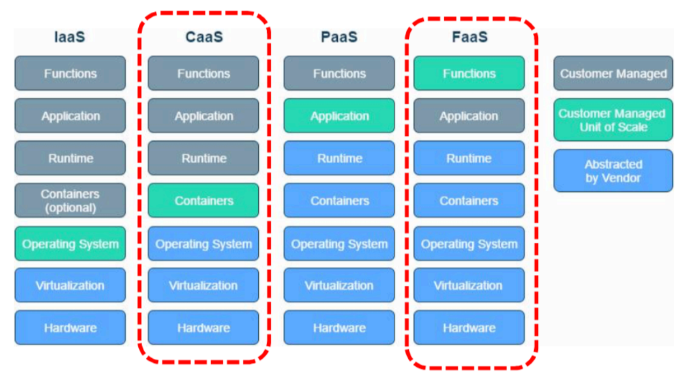

IBM:
* 30% less to design and build **Containerized data center**
* Cheaper than air conditionining dropped ceilings/raised floors

## Cloud Deployment mode

### Public Cloud
Cloud infrastructure is available to the general public, owned by organization selling cloud services
* Large scale infrastructure available on a rental basis

### Private Cloud
Infrastructure for **single organization only**, may be managed by the org or a 3rd party(Virtual Private Cloud), hosted internally or externally

Key techniques
* Virtualization techniques(VMWare, Xen, KVM) 
* Virtual Private network(VPN)

`More expensive, more secure(behind firewall)`
* Still have to buy, build and manage
* May not free from the responsibility for procurring (hardware+software upgrade$$) and maintenance(in-house expertise $$$)

> New York Times "Time Machine": 15 million articles were put into the clous on servers owned by Amazon

* Open-source Software for building private and public clouds: **Open Stack** and **Apache CLoudStack**

### Community Cloud
Shared by several organizations that have shared concerns

Some users may required different levels of security

* High Security: Access to cloud is granted only after a trusted validation of identity(required by regulating bodies)

* High Availability: Resources are 99.99% available(or better): **Banking** and **Military**

* High Performance: Optimized for high transaction rates and extremely low-latency: **High Frequency Trading(HFT)**

**GovernmentClouds**

Government organizations may share computing infrastructure on the cloud to manage data related to citizens: **Amazon AWS GovCloud** and **IBM SmartCloud** for government(SCG)

**Cloud for High Performance Computing**

A different set of requirements
* Close to the 'metal'
* User-space communication(bypass OS)
* high-speed interconnect: **InfiniBand**

Clients share a common set of "Big Data" - ranging in size from Terabytes to Petabyes. Need a very fast I/O subsystem (SSD-based storage)

**Financial Services Clouds**

Require microseconds or at least milliseconds of response time and latency measurements

**NYSE Technologies: Financial Services Community Cloud**(electronic trading, maket data analysis)

**Hybrid Clouds**

Integrated cloud service utilizing both private and public clouds to perform distinct functions within the same organization

* non-sensitive operations on public cloud, and sensitive operations handled in-house(private)
* bound by standardized or proprietary technilogy that enables 

TPU Tensor Processing Units